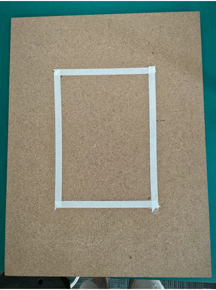
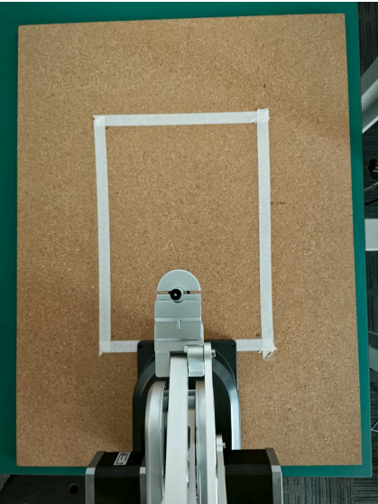
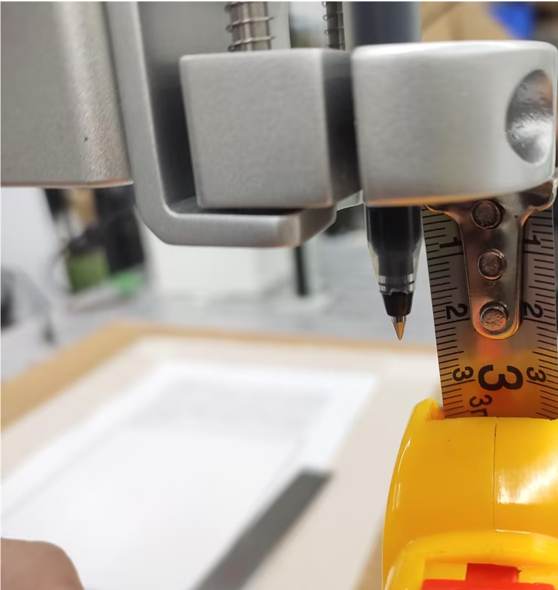
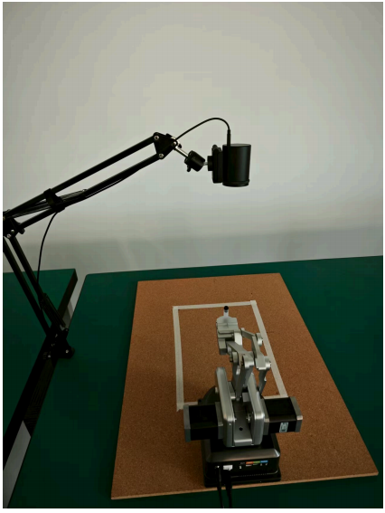
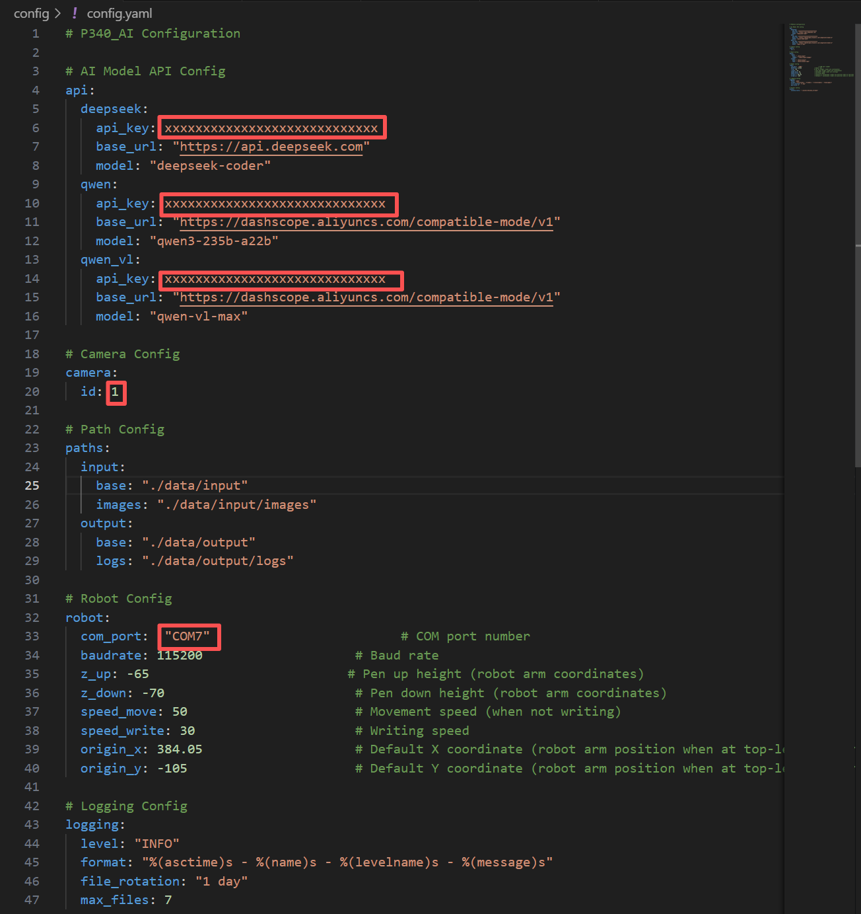
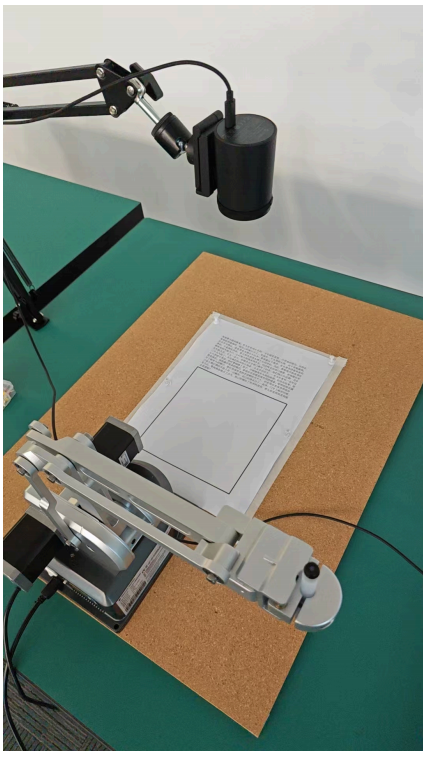
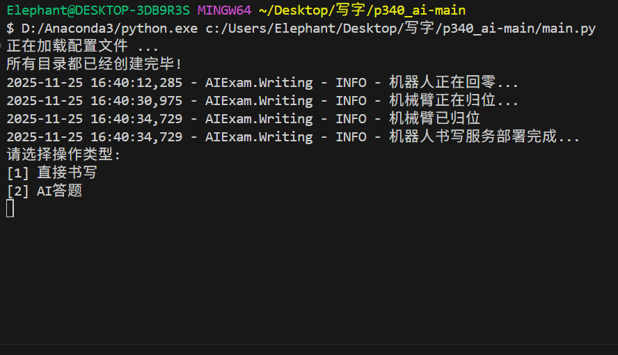
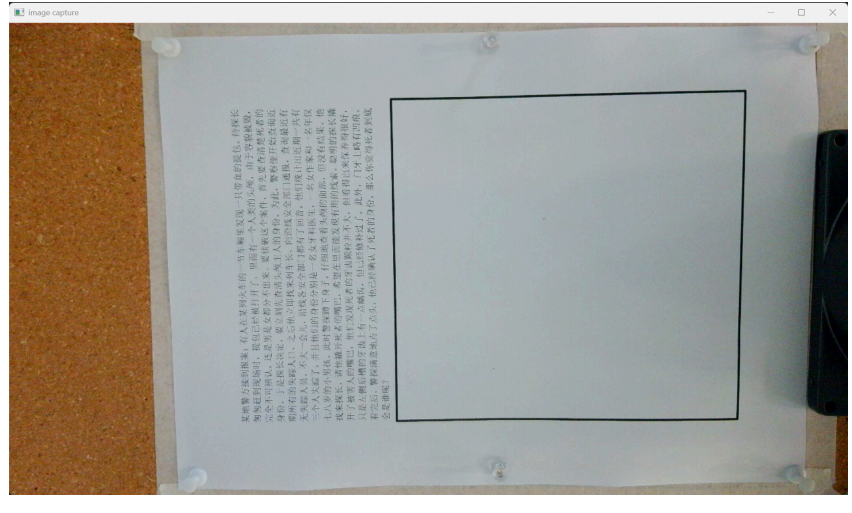
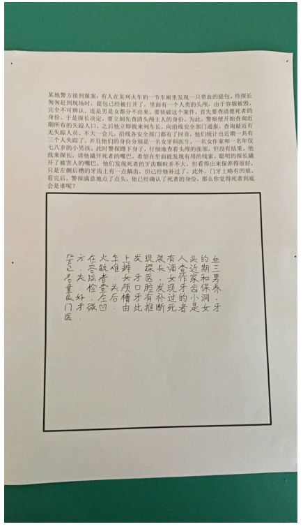

# P340 AI智能答题机器人案例
## 1 硬件搭建
准备软木板(图中的胶带为A4纸辅助定位)



将P340机械臂放置于木板底侧居中位置



笔尖距笔夹参考距离22mm.



搭建相机支架，并将摄像头放置于顶部，形成从上到下的俯视角。摄像机距木板参考距离330mm.将机械臂通上电后，接入数据线和相机线至用户电脑上即可



## 2 软件搭建
**注意事项**：python版本要在3.8以上
### 依赖库安装
```bash
pip install -r requirements.txt
```
### API_KEY获取
用户需要自己开通通义千问及deepseek的账号，并且配置自己的API_KEY，API_KEY的调用需要收费，用户在使用前需关注自己的通义千问及deepseek账号的余额

**通义千问API_KEY申请参考视频**:https://www.bilibili.com/video/BV1iHVazvEvS/?spm_id_from=333.337.search-card.all.click&vd_source=672e3f7240eaaca210b45e7c033dc45f

**deepseek API_KEY申请参考视频**：https://www.bilibili.com/video/BV1vCcge7E6W/?spm_id_from=333.337.search-card.all.click&vd_source=672e3f7240eaaca210b45e7c033dc45f

### 项目配置
修改/config目录下的config.yaml文件对软件进行配置，在开始执行程序前，请务必配置正确。在deepseek的api_key填入用户自己的deepseek的api_key，在qwen和qwen_vl的api_key填入用户自己的通义千问的api_key。在camera中填入相机的id,若使用的是笔记本电脑，id默认为1，若是台式电脑，id一般为0。在robot的com_port中填入机械臂实际串口号




### 项目运行
确保用户电脑连接网络后，运行main.py文件，等待机械臂回零，然后偏向一侧。


将答题纸固定在软木板中央，答题纸底部紧贴机械臂



在终端输入1或2，按下键盘回车键确定模式，若是选择直接书写，在终端输入想要的文字内容后，按下键盘回车键即可，机械臂便会开始书写用户输入的内容，若是AI答题模式，会自动打开相机获取内容



随后手动调节摄像头和软木板，使图像捕获界面如下图所示（图像上方留白约六分之一），务必按照该图进行调整，确保相机画面与下面的参考图片尽量保持一致，否则会导致书写区域不对



按下空格捕获图像并等待后续全部流程，并获得最终的结果




